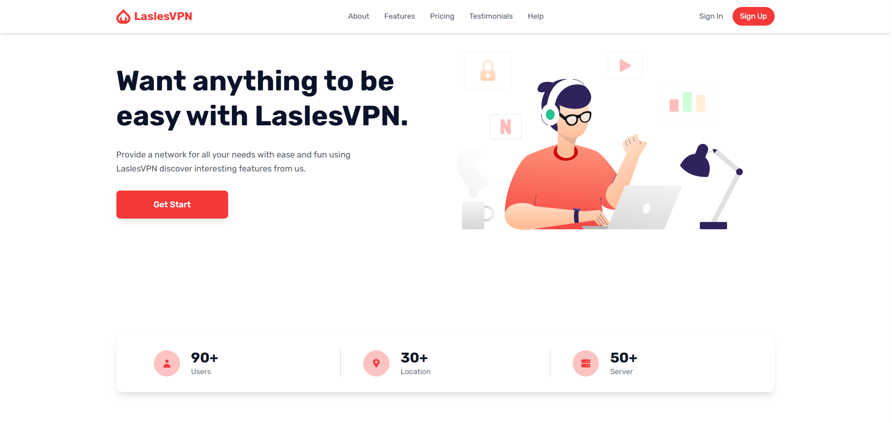

# 🔐 LaslesVPN Landing Page

A modern, responsive landing page for **LaslesVPN**, built with **HTML**, **Tailwind CSS**, and enhanced with animations and sliders using **AOS** and **Swiper.js**.



---

## 🚀 Features

- ⚡ Fully responsive layout
- 🎨 Styled with Tailwind CSS
- 🎞️ Smooth animations using AOS (Animate On Scroll)
- 🖼️ Interactive sliders powered by Swiper.js
- 🧩 Clean and reusable UI components
- 📱 Mobile-first design approach

---

## 🛠️ Tech Stack

- **HTML5**
- **CSS**
- **Tailwind CSS**
- **Swiper.js**
- **AOS (Animate On Scroll)**

---

## 📂 Project Structure

```bash
laslesvpn/
│
├── index.html
├── README.md
├── LaslesVPN.png
│
├── src/
│   ├── input.css
│   └── output.css
│
└── assets/
    ├── images/
    └── icons/
```

---

## 📦 Installation & Setup

1. **Clone the repository**

   ```bash
   git clone https://github.com/nurnahian/laslesvpn.git
   ```

2. **Navigate to the project folder**

   ```bash
   cd laslesvpn
   ```

3. **Install Tailwind CSS (if editing styles)**

   ```bash
   npm install
   ```

4. **Build Tailwind CSS**

   ```bash
   npx tailwindcss -i ./src/input.css -o ./src/output.css --watch
   ```

5. **Open `index.html`**
   - Simply open it in your browser or use Live Server.

---

## 📸 Screenshot


---

## 📚 External Libraries Used

- **Tailwind CSS**
- **Swiper.js**
- **AOS (Animate On Scroll)**

---

## ✨ Future Improvements

- 🌐 Add dark mode support
- ⚙️ Convert to React or Next.js
- 📊 Add pricing comparison animations

---

## 📄 License

This project is open-source and available under the **MIT License**.

---

## 🙌 Acknowledgements

- UI inspired by modern SaaS & VPN landing pages
- Icons and illustrations from open-source resources
